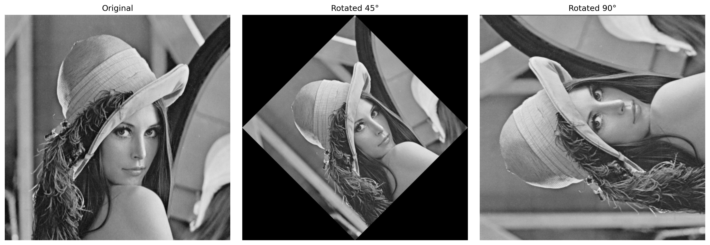
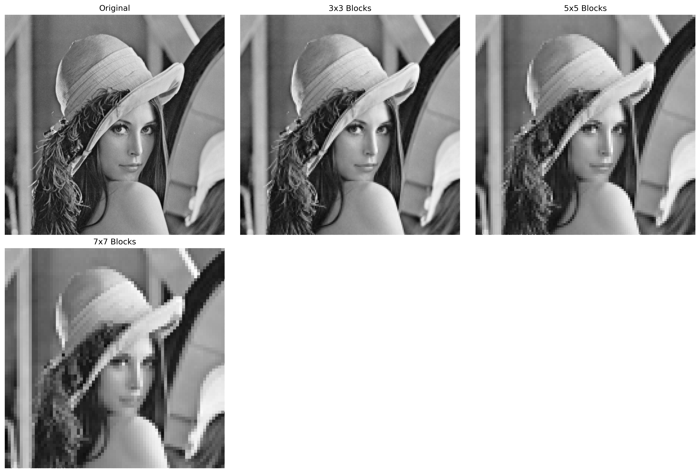

# EC7212 Computer Vision and Image Processing

## Assignment Report

### Student Information

- **Name:** Pramitha Jayasooriya
- **Date:** June 21, 2025

## Introduction

This report documents the implementation of four fundamental image processing operations as required for the EC7212 Computer Vision and Image Processing assignment. The implemented operations include:

1. Intensity level reduction
2. Spatial averaging
3. Image rotation
4. Spatial resolution reduction through block averaging

Each operation was implemented in Python using libraries such as OpenCV, NumPy, and Matplotlib. All implementations feature command-line interfaces for ease of use and flexibility.

## Project Structure

The project follows a structured organization with separate Python files for each task and dedicated folders for images and results:

```
.
├── images/                 # Input images
│   ├── lena_standard.png
│   ├── mandrill.png
│   └── smriti.png
├── results/                # Output images (combined images)
│   ├── task1_*/            # Individual results for Task 1
│   ├── task2_*/            # Individual results for Task 2
│   ├── task3_*/            # Individual results for Task 3
│   └── task4_*/            # Individual results for Task 4
├── task1_intensity_reduction.py
├── task2_spatial_averaging.py
├── task3_image_rotation.py
├── task4_block_averaging.py
└── README.md
```

## Task 1: Intensity Level Reduction

### Algorithm Description

This task involves reducing the number of intensity levels in an image from 256 (8-bit) to a specified number of levels, which must be a power of 2 (e.g., 128, 64, 32, 16, 8, 4, or 2).

The implementation uses bit manipulation for efficiency:

1. Calculate the number of bits needed to represent the desired number of levels
2. Shift right to eliminate the least significant bits
3. Shift left to restore the original range

### Implementation Highlights

```python
def reduce_intensity_levels(image, n_levels):
    # Validate input
    if n_levels <= 0 or (n_levels & (n_levels - 1)) != 0:
        raise ValueError("Number of levels must be a positive power of 2")
  
    # Calculate the number of bits needed
    bits = int(np.log2(n_levels))
  
    # Reduce intensity levels
    # Shift right to reduce bits, then shift left to restore range
    reduced_image = (image >> (8 - bits)) << (8 - bits)
  
    return reduced_image
```

### Results

The image below shows the original "mandrill" image and the results of intensity level reduction to various powers of 2 (128, 64, 32, 16, 8, 4, 2):


*Figure 1: Intensity level reduction results for lena image*

As the number of intensity levels decreases, noticeable contouring and posterization effects appear in the image. At 2 levels, the image becomes essentially a binary image, with only black and white pixels.

## Task 2: Spatial Averaging

### Algorithm Description

This task implements spatial averaging with different neighborhood sizes: 3×3, 10×10, and 20×20. Spatial averaging is a simple yet effective method for image smoothing and noise reduction.

The implementation creates a uniform kernel of the specified size, where each element equals 1/(kernel_size²). This kernel is then convolved with the image using OpenCV's filter2D function.

### Implementation Highlights

```python
def spatial_averaging(image, kernel_size):
    # Create averaging kernel
    kernel = np.ones((kernel_size, kernel_size), dtype=np.float32) / (kernel_size * kernel_size)
  
    # Apply convolution
    averaged_image = cv2.filter2D(image, -1, kernel)
  
    return averaged_image.astype(np.uint8)
```

### Results

The image below shows the original "lena" image and the results of spatial averaging with different kernel sizes (3×3, 10×10, 20×20):


*Figure 2: Spatial averaging results with different kernel sizes*

As the kernel size increases, the image becomes progressively blurred. The 3×3 kernel produces subtle smoothing while preserving most details, whereas the 20×20 kernel causes significant blurring and loss of fine details.

## Task 3: Image Rotation

### Algorithm Description

This task implements image rotation by 45 and 90 degrees. The implementation uses OpenCV's getRotationMatrix2D and warpAffine functions, with careful consideration to:

1. Calculate the proper dimensions for the output image to avoid cropping
2. Adjust the rotation matrix to center the rotated image
3. Apply the transformation with appropriate interpolation

### Implementation Highlights

```python
def rotate_image(image, angle):
    # Get image dimensions
    height, width = image.shape
  
    # Calculate rotation matrix
    center = (width // 2, height // 2)
    rotation_matrix = cv2.getRotationMatrix2D(center, angle, 1.0)
  
    # Calculate new dimensions to avoid cropping
    cos_angle = np.abs(rotation_matrix[0, 0])
    sin_angle = np.abs(rotation_matrix[0, 1])
    new_width = int(height * sin_angle + width * cos_angle)
    new_height = int(height * cos_angle + width * sin_angle)
  
    # Adjust rotation matrix for new dimensions
    rotation_matrix[0, 2] += (new_width - width) / 2
    rotation_matrix[1, 2] += (new_height - height) / 2
  
    # Apply rotation
    rotated_image = cv2.warpAffine(image, rotation_matrix, 
                                 (new_width, new_height), 
                                 borderValue=0)
  
    return rotated_image
```

### Results

The image below shows the original "lena" image and the results of rotation by 45 and 90 degrees:



*Figure 3: Image rotation results for lena image*

The rotation is implemented correctly, with proper dimensions to ensure no part of the image is cropped during rotation. The black corners are filled where the original image data is not available.

## Task 4: Spatial Resolution Reduction

### Algorithm Description

This task reduces the spatial resolution of an image by replacing non-overlapping blocks with their average values, implemented for 3×3, 5×5, and 7×7 block sizes.

The algorithm:

1. Divides the image into non-overlapping blocks of the specified size
2. Computes the average intensity for each block
3. Replaces all pixels in the block with the computed average intensity

### Implementation Highlights

```python
def block_averaging(image, block_size):
    height, width = image.shape
    result = np.copy(image).astype(np.float32)
  
    # Process blocks
    for i in range(0, height - block_size + 1, block_size):
        for j in range(0, width - block_size + 1, block_size):
            # Extract block
            block = image[i:i+block_size, j:j+block_size]
        
            # Calculate average
            avg_value = np.mean(block)
        
            # Replace all pixels in block with average
            result[i:i+block_size, j:j+block_size] = avg_value
  
    return result.astype(np.uint8)
```

### Results

The image below shows the original "lena" image and the results of block averaging with different block sizes (3×3, 5×5, 7×7):



*Figure 4: Block averaging results with different block sizes*

As the block size increases, the spatial resolution decreases, resulting in a more pixelated appearance. The 7×7 block size shows the most pronounced pixelation effect.

## Usage Instructions

Each task is implemented as a separate Python script that can be run from the command line:

### Task 1: Intensity Level Reduction

```bash
python3 task1_intensity_reduction.py [image_name] [max_level] [min_level]
```

Example: `python3 task1_intensity_reduction.py mandrill 256 2`

### Task 2: Spatial Averaging

```bash
python3 task2_spatial_averaging.py [image_name]
```

Example: `python3 task2_spatial_averaging.py lena`

### Task 3: Image Rotation

```bash
python3 task3_image_rotation.py [image_name]
```

Example: `python3 task3_image_rotation.py smriti`

### Task 4: Block Averaging

```bash
python3 task4_block_averaging.py [image_name]
```

Example: `python3 task4_block_averaging.py mandrill`

## Conclusion

This assignment implemented four fundamental image processing operations that demonstrate important concepts in computer vision:

1. **Intensity level reduction** illustrates how quantization affects visual perception and introduces posterization effects.
2. **Spatial averaging** demonstrates spatial domain filtering for image smoothing and the trade-off between noise reduction and detail preservation.
3. **Image rotation** shows geometric transformations and the challenges of preserving image content during rotation.
4. **Block averaging** illustrates spatial resolution reduction and its impact on image quality.

The implementations are designed to be modular, well-documented, and user-friendly, with command-line arguments for flexibility and organized file structure for clarity.

## Appendix: Complete Code Listings

### Task 1: Intensity Level Reduction (task1_intensity_reduction.py)

```python
"""
Task 1: Intensity Level Reduction
EC7212 - Computer Vision and Image Processing Assignment

This script reduces the number of intensity levels in an image from 256 to a specified number
(which must be a power of 2).
"""

import cv2
import numpy as np
import matplotlib.pyplot as plt
import os

def reduce_intensity_levels(image, n_levels):
    """
    Reduce intensity levels from 256 to specified number (power of 2)
  
    Args:
        image (ndarray): Input image
        n_levels (int): Desired number of intensity levels (must be power of 2)
    
    Returns:
        ndarray: Image with reduced intensity levels
    """
    # Validate input
    if n_levels <= 0 or (n_levels & (n_levels - 1)) != 0:
        raise ValueError("Number of levels must be a positive power of 2")
  
    # Calculate the number of bits needed
    bits = int(np.log2(n_levels))
  
    # Reduce intensity levels
    # Shift right to reduce bits, then shift left to restore range
    reduced_image = (image >> (8 - bits)) << (8 - bits)
  
    return reduced_image

def display_results(images, titles, save_path=None, save_individual=False, individual_dir=None):
    """
    Display multiple images in a grid and optionally save individual images
  
    Args:
        images (list): List of images to display
        titles (list): List of titles for each image
        save_path (str, optional): Path to save the figure
        save_individual (bool, optional): Whether to save individual images
        individual_dir (str, optional): Directory to save individual images
    """
    n_images = len(images)
    cols = min(3, n_images)
    rows = (n_images + cols - 1) // cols
  
    plt.figure(figsize=(15, 5 * rows))
  
    for i, (img, title) in enumerate(zip(images, titles)):
        plt.subplot(rows, cols, i + 1)
        plt.imshow(img, cmap='gray')
        plt.title(title)
        plt.axis('off')
    
        # Save individual images if requested
        if save_individual and individual_dir and i > 0:  # Skip original image (i=0)
            # Create safe filename from title
            safe_title = title.replace(' ', '_').replace('(', '').replace(')', '')
            img_path = os.path.join(individual_dir, f"{safe_title}.png")
        
            # Create individual figure and save
            plt.figure(figsize=(5, 5))
            plt.imshow(img, cmap='gray')
            plt.title(title)
            plt.axis('off')
            plt.tight_layout()
            plt.savefig(img_path, dpi=300, bbox_inches='tight')
            plt.close()  # Close individual figure
            print(f"Saved individual image: {img_path}")
  
    plt.tight_layout()
  
    if save_path:
        plt.savefig(save_path, dpi=300, bbox_inches='tight')
  
    plt.show()

def main():
    """
    Main function to run the intensity level reduction
    Command line usage: python task1_intensity_reduction.py [image_name] [max_level] [min_level]
    """
    import sys
  
    # Define image options with paths relative to the 'images' directory
    image_options = {
        "lena": "lena_standard.png",      # Classic test image with good gradients
        "mandrill": "mandrill.png",        # Detailed texture
        "smriti": "smriti.png"             # Additional test image
    }
  
    # Parse command line arguments if provided
    args = sys.argv[1:]
  
    # Default values
    selected_image = "mandrill"
    max_level = 256
    min_level = 2
  
    # Process command line arguments if provided
    if len(args) >= 1 and args[0] in image_options:
        selected_image = args[0]
        print(f"Using specified image: {selected_image}")
  
    if len(args) >= 3:
        try:
            max_level = int(args[1])
            min_level = int(args[2])
        
            # Ensure max_level is 256 or less (8-bit images)
            max_level = min(max_level, 256)
        
            # Ensure min_level is at least 2
            min_level = max(min_level, 2)
        
            print(f"Using specified levels: max={max_level}, min={min_level}")
        except ValueError:
            print("Invalid level values. Using defaults: max=256, min=2")
  
    image_filename = image_options[selected_image]
  
    # Get absolute paths for images and results folders
    current_dir = os.path.dirname(os.path.abspath(__file__))
    images_dir = os.path.join(current_dir, "images")
    results_dir = os.path.join(current_dir, "results")
  
    # Create results directory if it doesn't exist
    if not os.path.exists(results_dir):
        os.makedirs(results_dir)
  
    # Full path to the image file
    image_path = os.path.join(images_dir, image_filename)
  
    print(f"Attempting to load image from: {image_path}")
  
    # Load the image
    original_image = cv2.imread(image_path, cv2.IMREAD_GRAYSCALE)
    if original_image is None:
        raise ValueError(f"Could not load image from {image_path}")
  
    print(f"Image loaded successfully: {original_image.shape}")
  
    # Function to generate intensity levels from max_level down to min_level in powers of 2
    def generate_intensity_levels(max_level=256, min_level=2):
        """
        Generate a list of intensity levels in powers of 2, from max_level down to min_level
    
        Args:
            max_level (int): Maximum intensity level (default: 256)
            min_level (int): Minimum intensity level (default: 2)
        
        Returns:
            list: List of intensity levels in descending order
        """
        levels = []
        current_level = max_level // 2  # Start from max_level/2 since max_level is the original
    
        while current_level >= min_level:
            levels.append(current_level)
            current_level = current_level // 2
        
        return levels
  
    # Intensity level reduction - use the max_level and min_level from command line arguments
    # Note: These values are already set from command line arguments or defaults
  
    # Generate levels dynamically instead of hardcoding
    levels_to_test = generate_intensity_levels(max_level, min_level)
    print(f"Testing intensity levels: {levels_to_test}")
  
    intensity_images = [original_image]
    intensity_titles = [f"Original ({max_level} levels)"]
  
    # Validate intensity levels
    for level in levels_to_test:
        if not (level & (level - 1) == 0):  # Check if power of 2
            print(f"Warning: {level} is not a power of 2, skipping...")
            continue
  
    for n_levels in levels_to_test:
        reduced = reduce_intensity_levels(original_image, n_levels)
        intensity_images.append(reduced)
        intensity_titles.append(f"{n_levels} levels")
        print(f"Reduced to {n_levels} intensity levels")
  
    # Create a subdirectory for individual images
    task_dir = os.path.join(results_dir, f"task1_{selected_image}")
    if not os.path.exists(task_dir):
        os.makedirs(task_dir)
        print(f"Created directory for individual images: {task_dir}")
  
    # Display and save results
    result_filename = f"task1_{selected_image}_intensity_reduction.png"
    result_path = os.path.join(results_dir, result_filename)
  
    # Save both the combined image and individual images
    display_results(
        intensity_images, 
        intensity_titles, 
        save_path=result_path,
        save_individual=True,
        individual_dir=task_dir
    )
    print(f"Results saved as {result_path}")
    print(f"Individual images saved in {task_dir}")

def print_usage():
    """Print usage instructions"""
    print("\nUsage: python3 task1_intensity_reduction.py [image_name] [max_level] [min_level]")
    print("\nArguments:")
    print("  image_name    : Name of the image to use (lena, mandrill, smriti)")
    print("  max_level     : Maximum intensity level (default: 256)")
    print("  min_level     : Minimum intensity level (default: 2)")
    print("\nExample:")
    print("  python3 task1_intensity_reduction.py lena 256 2")
    print("  python3 task1_intensity_reduction.py mandrill 256 2")

if __name__ == "__main__":
    import sys
    if len(sys.argv) > 1 and sys.argv[1] in ['-h', '--help', 'help']:
        print_usage()
    else:
        main()
```

### Task 2: Spatial Averaging (task2_spatial_averaging.py)

```python
"""
Task 2: Spatial Averaging
EC7212 - Computer Vision and Image Processing Assignment

This script performs spatial averaging on an image with different neighborhood sizes
(3x3, 10x10, and 20x20).
"""

import cv2
import numpy as np
import matplotlib.pyplot as plt
import os

def spatial_averaging(image, kernel_size):
    """
    Perform spatial averaging on an image using a specified kernel size
  
    Args:
        image (ndarray): Input image
        kernel_size (int): Size of the averaging kernel (e.g., 3, 10, 20)
    
    Returns:
        ndarray: Spatially averaged image
    """
    # Create averaging kernel
    kernel = np.ones((kernel_size, kernel_size), dtype=np.float32) / (kernel_size * kernel_size)
  
    # Apply convolution
    averaged_image = cv2.filter2D(image, -1, kernel)
  
    return averaged_image.astype(np.uint8)

def display_results(images, titles, save_path=None, save_individual=False, individual_dir=None):
    """
    Display multiple images in a grid and optionally save individual images
  
    Args:
        images (list): List of images to display
        titles (list): List of titles for each image
        save_path (str, optional): Path to save the figure
        save_individual (bool, optional): Whether to save individual images
        individual_dir (str, optional): Directory to save individual images
    """
    n_images = len(images)
    cols = min(3, n_images)
    rows = (n_images + cols - 1) // cols
  
    plt.figure(figsize=(15, 5 * rows))
  
    for i, (img, title) in enumerate(zip(images, titles)):
        plt.subplot(rows, cols, i + 1)
        plt.imshow(img, cmap='gray')
        plt.title(title)
        plt.axis('off')
    
        # Save individual images if requested
        if save_individual and individual_dir and i > 0:  # Skip original image (i=0)
            # Create safe filename from title
            safe_title = title.replace(' ', '_').replace('(', '').replace(')', '').replace('×', 'x')
            img_path = os.path.join(individual_dir, f"{safe_title}.png")
        
            # Create individual figure and save
            plt.figure(figsize=(5, 5))
            plt.imshow(img, cmap='gray')
            plt.title(title)
            plt.axis('off')
            plt.tight_layout()
            plt.savefig(img_path, dpi=300, bbox_inches='tight')
            plt.close()  # Close individual figure
            print(f"Saved individual image: {img_path}")
  
    plt.tight_layout()
  
    if save_path:
        plt.savefig(save_path, dpi=300, bbox_inches='tight')
  
    plt.show()

def main():
    """
    Main function to run spatial averaging
    Command line usage: python task2_spatial_averaging.py [image_name]
    """
    import sys
  
    # Define image options with paths relative to the 'images' directory
    image_options = {
        "lena": "lena_standard.png",      # Classic test image with good gradients
        "mandrill": "mandrill.png",        # Highly textured image
        "smriti": "smriti.png"             # Additional test image
    }
  
    # Parse command line arguments if provided
    args = sys.argv[1:]
  
    # Default value
    selected_image = "lena"  # Cameraman is good for showing edge effects
  
    # Process command line arguments if provided
    if len(args) >= 1 and args[0] in image_options:
        selected_image = args[0]
        print(f"Using specified image: {selected_image}")
  
    image_filename = image_options[selected_image]
  
    # Get absolute paths for images and results folders
    current_dir = os.path.dirname(os.path.abspath(__file__))
    images_dir = os.path.join(current_dir, "images")
    results_dir = os.path.join(current_dir, "results")
  
    # Create results directory if it doesn't exist
    if not os.path.exists(results_dir):
        os.makedirs(results_dir)
  
    # Full path to the image file
    image_path = os.path.join(images_dir, image_filename)
  
    print(f"Attempting to load image from: {image_path}")
  
    # Load the image
    original_image = cv2.imread(image_path, cv2.IMREAD_GRAYSCALE)
    if original_image is None:
        raise ValueError(f"Could not load image from {image_path}")
  
    print(f"Image loaded successfully: {original_image.shape}")
  
    # Task 2: Spatial averaging
    kernel_sizes = [3, 10, 20]
    averaging_images = [original_image]
    averaging_titles = ["Original"]
  
    for kernel_size in kernel_sizes:
        averaged = spatial_averaging(original_image, kernel_size)
        averaging_images.append(averaged)
        averaging_titles.append(f"{kernel_size}x{kernel_size} Average")
        print(f"Applied {kernel_size}x{kernel_size} spatial averaging")
  
    # Create a subdirectory for individual images
    task_dir = os.path.join(results_dir, f"task2_{selected_image}")
    if not os.path.exists(task_dir):
        os.makedirs(task_dir)
        print(f"Created directory for individual images: {task_dir}")
  
    # Display and save results
    result_filename = f"task2_{selected_image}_spatial_averaging.png"
    result_path = os.path.join(results_dir, result_filename)
  
    # Save both the combined image and individual images
    display_results(
        averaging_images, 
        averaging_titles, 
        save_path=result_path,
        save_individual=True,
        individual_dir=task_dir
    )
    print(f"Results saved as {result_path}")
    print(f"Individual images saved in {task_dir}")

def print_usage():
    """Print usage instructions"""
    print("\nUsage: python3 task2_spatial_averaging.py [image_name]")
    print("\nArguments:")
    print("  image_name    : Name of the image to use (lena, mandrill, smriti)")
    print("\nExample:")
    print("  python3 task2_spatial_averaging.py lena")
    print("  python3 task2_spatial_averaging.py mandrill")

if __name__ == "__main__":
    import sys
    if len(sys.argv) > 1 and sys.argv[1] in ['-h', '--help', 'help']:
        print_usage()
    else:
        main()
```

### Task 3: Image Rotation (task3_image_rotation.py)

```python
"""
Task 3: Image Rotation
EC7212 - Computer Vision and Image Processing Assignment

This script rotates an image by 45 and 90 degrees.
"""

import cv2
import numpy as np
import matplotlib.pyplot as plt
import os

def rotate_image(image, angle):
    """
    Rotate image by specified angle
  
    Args:
        image (ndarray): Input image
        angle (float): Rotation angle in degrees
    
    Returns:
        ndarray: Rotated image
    """
    # Get image dimensions
    height, width = image.shape
  
    # Calculate rotation matrix
    center = (width // 2, height // 2)
    rotation_matrix = cv2.getRotationMatrix2D(center, angle, 1.0)
  
    # Calculate new dimensions to avoid cropping
    cos_angle = np.abs(rotation_matrix[0, 0])
    sin_angle = np.abs(rotation_matrix[0, 1])
    new_width = int(height * sin_angle + width * cos_angle)
    new_height = int(height * cos_angle + width * sin_angle)
  
    # Adjust rotation matrix for new dimensions
    rotation_matrix[0, 2] += (new_width - width) / 2
    rotation_matrix[1, 2] += (new_height - height) / 2
  
    # Apply rotation
    rotated_image = cv2.warpAffine(image, rotation_matrix, 
                                 (new_width, new_height), 
                                 borderValue=0)
  
    return rotated_image

def display_results(images, titles, save_path=None, save_individual=False, individual_dir=None):
    """
    Display multiple images in a grid and optionally save individual images
  
    Args:
        images (list): List of images to display
        titles (list): List of titles for each image
        save_path (str, optional): Path to save the figure
        save_individual (bool, optional): Whether to save individual images
        individual_dir (str, optional): Directory to save individual images
    """
    n_images = len(images)
    cols = min(3, n_images)
    rows = (n_images + cols - 1) // cols
  
    plt.figure(figsize=(15, 5 * rows))
  
    for i, (img, title) in enumerate(zip(images, titles)):
        plt.subplot(rows, cols, i + 1)
        plt.imshow(img, cmap='gray')
        plt.title(title)
        plt.axis('off')
    
        # Save individual images if requested
        if save_individual and individual_dir and i > 0:  # Skip original image (i=0)
            # Create safe filename from title
            safe_title = title.replace(' ', '_').replace('(', '').replace(')', '').replace('°', 'deg')
            img_path = os.path.join(individual_dir, f"{safe_title}.png")
        
            # Create individual figure and save
            plt.figure(figsize=(5, 5))
            plt.imshow(img, cmap='gray')
            plt.title(title)
            plt.axis('off')
            plt.tight_layout()
            plt.savefig(img_path, dpi=300, bbox_inches='tight')
            plt.close()  # Close individual figure
            print(f"Saved individual image: {img_path}")
  
    plt.tight_layout()
  
    if save_path:
        plt.savefig(save_path, dpi=300, bbox_inches='tight')
  
    plt.show()

def main():
    """
    Main function to run image rotation
    Command line usage: python task3_image_rotation.py [image_name]
    """
    import sys
  
    # Define image options with paths relative to the 'images' directory
    image_options = {
        "lena": "lena_standard.png",      # Classic test image
        "mandrill": "mandrill.png",        # Detailed image
        "smriti": "smriti.png"             # Additional test image
    }
  
    # Parse command line arguments if provided
    args = sys.argv[1:]
  
    # Default value
    selected_image = "lena"
  
    # Process command line arguments if provided
    if len(args) >= 1 and args[0] in image_options:
        selected_image = args[0]
        print(f"Using specified image: {selected_image}")
  
    image_filename = image_options[selected_image]
  
    # Get absolute paths for images and results folders
    current_dir = os.path.dirname(os.path.abspath(__file__))
    images_dir = os.path.join(current_dir, "images")
    results_dir = os.path.join(current_dir, "results")
  
    # Create results directory if it doesn't exist
    if not os.path.exists(results_dir):
        os.makedirs(results_dir)
  
    # Full path to the image file
    image_path = os.path.join(images_dir, image_filename)
  
    print(f"Attempting to load image from: {image_path}")
  
    # Load the image
    original_image = cv2.imread(image_path, cv2.IMREAD_GRAYSCALE)
    if original_image is None:
        raise ValueError(f"Could not load image from {image_path}")
  
    print(f"Image loaded successfully: {original_image.shape}")
  
    # Task 3: Image rotation
    angles = [45, 90]
    rotation_images = [original_image]
    rotation_titles = ["Original"]
  
    for angle in angles:
        rotated = rotate_image(original_image, angle)
        rotation_images.append(rotated)
        rotation_titles.append(f"Rotated {angle}°")
        print(f"Rotated image by {angle} degrees")
  
    # Create a subdirectory for individual images
    task_dir = os.path.join(results_dir, f"task3_{selected_image}")
    if not os.path.exists(task_dir):
        os.makedirs(task_dir)
        print(f"Created directory for individual images: {task_dir}")
  
    # Display and save results
    result_filename = f"task3_{selected_image}_rotation.png"
    result_path = os.path.join(results_dir, result_filename)
  
    # Save both the combined image and individual images
    display_results(
        rotation_images, 
        rotation_titles, 
        save_path=result_path,
        save_individual=True,
        individual_dir=task_dir
    )
    print(f"Results saved as {result_path}")
    print(f"Individual images saved in {task_dir}")

def print_usage():
    """Print usage instructions"""
    print("\nUsage: python3 task3_image_rotation.py [image_name]")
    print("\nArguments:")
    print("  image_name    : Name of the image to use (lena, mandrill, smriti)")
    print("\nExample:")
    print("  python3 task3_image_rotation.py lena")
    print("  python3 task3_image_rotation.py mandrill")

if __name__ == "__main__":
    import sys
    if len(sys.argv) > 1 and sys.argv[1] in ['-h', '--help', 'help']:
        print_usage()
    else:
        main()
```

### Task 4: Block Averaging (task4_block_averaging.py)

```python
"""
Task 4: Spatial Resolution Reduction by Block Averaging
EC7212 - Computer Vision and Image Processing Assignment

This script reduces the spatial resolution of an image by replacing non-overlapping blocks
with their average values. Implemented for 3x3, 5x5, and 7x7 block sizes.
"""

import cv2
import numpy as np
import matplotlib.pyplot as plt
import os

def block_averaging(image, block_size):
    """
    Replace non-overlapping blocks with their average
  
    Args:
        image (ndarray): Input image
        block_size (int): Size of the blocks (e.g., 3, 5, 7)
    
    Returns:
        ndarray: Image with block averaging applied
    """
    height, width = image.shape
    result = np.copy(image).astype(np.float32)
  
    # Process blocks
    for i in range(0, height - block_size + 1, block_size):
        for j in range(0, width - block_size + 1, block_size):
            # Extract block
            block = image[i:i+block_size, j:j+block_size]
        
            # Calculate average
            avg_value = np.mean(block)
        
            # Replace all pixels in block with average
            result[i:i+block_size, j:j+block_size] = avg_value
  
    return result.astype(np.uint8)

def display_results(images, titles, save_path=None, save_individual=False, individual_dir=None):
    """
    Display multiple images in a grid and optionally save individual images
  
    Args:
        images (list): List of images to display
        titles (list): List of titles for each image
        save_path (str, optional): Path to save the figure
        save_individual (bool, optional): Whether to save individual images
        individual_dir (str, optional): Directory to save individual images
    """
    n_images = len(images)
    cols = min(3, n_images)
    rows = (n_images + cols - 1) // cols
  
    plt.figure(figsize=(15, 5 * rows))
  
    for i, (img, title) in enumerate(zip(images, titles)):
        plt.subplot(rows, cols, i + 1)
        plt.imshow(img, cmap='gray')
        plt.title(title)
        plt.axis('off')
    
        # Save individual images if requested
        if save_individual and individual_dir and i > 0:  # Skip original image (i=0)
            # Create safe filename from title
            safe_title = title.replace(' ', '_').replace('(', '').replace(')', '').replace('×', 'x')
            img_path = os.path.join(individual_dir, f"{safe_title}.png")
        
            # Create individual figure and save
            plt.figure(figsize=(5, 5))
            plt.imshow(img, cmap='gray')
            plt.title(title)
            plt.axis('off')
            plt.tight_layout()
            plt.savefig(img_path, dpi=300, bbox_inches='tight')
            plt.close()  # Close individual figure
            print(f"Saved individual image: {img_path}")
  
    plt.tight_layout()
  
    if save_path:
        plt.savefig(save_path, dpi=300, bbox_inches='tight')
  
    plt.show()

def main():
    """
    Main function to run block averaging
    Command line usage: python task4_block_averaging.py [image_name]
    """
    import sys
  
    # Define image options with paths relative to the 'images' directory
    image_options = {
        "lena": "lena_standard.png",      # Classic test image
        "mandrill": "mandrill.png",        # Highly detailed - great for showing resolution effects
        "smriti": "smriti.png"             # Additional test image
    }
  
    # Parse command line arguments if provided
    args = sys.argv[1:]
  
    # Default value
    selected_image = "lena"
  
    # Process command line arguments if provided
    if len(args) >= 1 and args[0] in image_options:
        selected_image = args[0]
        print(f"Using specified image: {selected_image}")
  
    image_filename = image_options[selected_image]
  
    # Get absolute paths for images and results folders
    current_dir = os.path.dirname(os.path.abspath(__file__))
    images_dir = os.path.join(current_dir, "images")
    results_dir = os.path.join(current_dir, "results")
  
    # Create results directory if it doesn't exist
    if not os.path.exists(results_dir):
        os.makedirs(results_dir)
  
    # Full path to the image file
    image_path = os.path.join(images_dir, image_filename)
  
    print(f"Attempting to load image from: {image_path}")
  
    # Load the image
    original_image = cv2.imread(image_path, cv2.IMREAD_GRAYSCALE)
    if original_image is None:
        raise ValueError(f"Could not load image from {image_path}")
  
    print(f"Image loaded successfully: {original_image.shape}")
  
    # Task 4: Block averaging
    block_sizes = [3, 5, 7]
    block_images = [original_image]
    block_titles = ["Original"]
  
    for block_size in block_sizes:
        block_averaged = block_averaging(original_image, block_size)
        block_images.append(block_averaged)
        block_titles.append(f"{block_size}x{block_size} Blocks")
        print(f"Applied {block_size}x{block_size} block averaging")
  
    # Create a subdirectory for individual images
    task_dir = os.path.join(results_dir, f"task4_{selected_image}")
    if not os.path.exists(task_dir):
        os.makedirs(task_dir)
        print(f"Created directory for individual images: {task_dir}")
  
    # Display and save results
    result_filename = f"task4_{selected_image}_block_averaging.png"
    result_path = os.path.join(results_dir, result_filename)
  
    # Save both the combined image and individual images
    display_results(
        block_images, 
        block_titles, 
        save_path=result_path,
        save_individual=True,
        individual_dir=task_dir
    )
    print(f"Results saved as {result_path}")
    print(f"Individual images saved in {task_dir}")

def print_usage():
    """Print usage instructions"""
    print("\nUsage: python3 task4_block_averaging.py [image_name]")
    print("\nArguments:")
    print("  image_name    : Name of the image to use (lena, mandrill, smriti)")
    print("\nExample:")
    print("  python3 task4_block_averaging.py lena")
    print("  python3 task4_block_averaging.py mandrill")

if __name__ == "__main__":
    import sys
    if len(sys.argv) > 1 and sys.argv[1] in ['-h', '--help', 'help']:
        print_usage()
    else:
        main()
```
